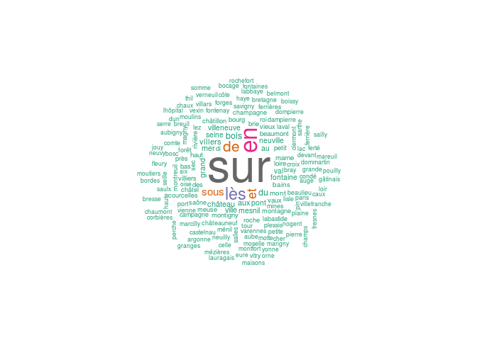

Inspired by [this work about the names of villages in France by Maëlle Salmon](https://github.com/masalmon/kervillebourg), I wanted to have a look at the data for further analysis.

I got a file of all French village names and geolocation from [Geonames](http://download.geonames.org/) used by Maëlle Salmon.

A first look at the data
========================

*data\_geonames* contains in fact a lot of data and not exclusively data about french cities. The information about the type of location of a row is contained in the *feature\_class* variable. The cities correspond to the value "P" for this variable. The other types of elements contained in the data set are about lakes, rivers, mountains, etc. (see <http://www.geonames.org/export/codes.html>)

``` r
cities_geonames <- data_geonames[which(data_geonames$feature_class == "P"),]
```

1.  The data set contains more rows that what we can expect: there are officially 35,756 cities in France (on first January 2016) and the data set contains 41767 rows.
2.  The variable *admin4\_code* seems to contain the Insee code of the cities. However, there are only 27587 unique Insee code in the database. It then seems that some cities are missing. To check that, I took the [list of the biggest cities in France](https://fr.wikipedia.org/wiki/Liste_des_communes_de_France_les_plus_peupl%C3%A9es) on Wikipedia, in terms of population. I used <http://wikitables.geeksta.net/> to convert the wiki table into csv. Then I checked if all the cities present in this list are present in *cities\_geonames*.

``` r
list_biggest_cities_fr_wiki <- read.csv("data/list_biggest_cities_fr_wiki.csv")
missing_cities <- setdiff(tolower(list_biggest_cities_fr_wiki$Commune), tolower(cities_geonames$name))
head(missing_cities)
```

    ## [1] "bordeaux"         "dijon"            "angers"          
    ## [4] "aix-en-provence"  "clermont-ferrand" "brest"

In this list of 272 big cities, 109 are missing in this data frame (e.g. Bordeaux, Dijon, Angers, etc.)

At this point of the analysis, I decided to use another data set. I got a [data set](https://www.data.gouv.fr/fr/datasets/listes-des-communes-geolocalisees-par-regions-departements-circonscriptions-nd/) on [data.gouv.fr](https://www.data.gouv.fr/fr/) which is an institutional open platform for french public data.

A first look at the second data set
===================================

``` r
cities_datagouv <- read.csv("data/eucircos_regions_departements_circonscriptions_communes_gps.csv", sep=";")

cities_datagouv <- cities_datagouv[, c(1:13)]
cities_datagouv$code_insee <- as.factor(cities_datagouv$code_insee)
cities_datagouv <- cities_datagouv[!cities_datagouv$nom_région %in% c("Guadeloupe", "Guyane", "La Réunion", "Martinique", "Mayotte", "Saint-Pierre-et-Miquelon"),]
cities_datagouv$nom_région <- factor(cities_datagouv$nom_région)
cities_datagouv$latitude <- as.numeric(as.character(cities_datagouv$latitude))
cities_datagouv$longitude <- as.numeric(as.character(cities_datagouv$longitude))
```

I only kept the data corresponding to the metropolitan France. There are 36562 unique code Insee and 34035 unique cities name in the data set.

``` r
summary(cities_datagouv[, c("latitude", "longitude")])
```

    ##     latitude       longitude      
    ##  Min.   :41.39   Min.   :-4.7667  
    ##  1st Qu.:45.22   1st Qu.: 0.6833  
    ##  Median :47.43   Median : 2.6167  
    ##  Mean   :47.00   Mean   : 2.7324  
    ##  3rd Qu.:48.85   3rd Qu.: 4.8500  
    ##  Max.   :51.08   Max.   : 9.5167  
    ##  NA's   :2830    NA's   :2892

As it can be observed, the localisation is not known for all the cities, there are 2894 missing localisations. I used the Geonames data to complete the data frame if it was possible (by using the name and the Insee code which are present in both data frames).

``` r
cities_datagouv_wo_na <- cities_datagouv[rowSums(is.na(cities_datagouv)) == 0,]
cities_datagouv_na <- cities_datagouv[rowSums(is.na(cities_datagouv)) > 0,]
cities_datagouv_na <- cities_datagouv_na[, c(1:11)]
geolocalisation <- cities_geonames[, c("name", "admin4_code", "longitude", "latitude")]
colnames(geolocalisation) <- c("nom_commune", "code_insee", "longitude", "latitude")
geolocalisation$latitude <- as.numeric(as.character(geolocalisation$latitude))
completed_cities_datagouv_na <- left_join(cities_datagouv_na, geolocalisation, by=c("nom_commune", "code_insee"))
cities_datagouv <- rbind(cities_datagouv_wo_na, completed_cities_datagouv_na)
```

1313 geolocation remain missing after this procedure.

A word cloud is generated using the cities' names.

<!-- -->

As it can be seen, the most frequent word by far is "saint", followed by "sur" that expresses a relationship with another geographic location (river, lake, etc.). I begin with the analysis of the "saint"-something cities.

Church related vocabulary
=========================

Saints and Saintes
------------------

My first analysis was to redo the *Saints et Saintes* analysis made by Maëlle Salmon to see if any difference can be observed. It consists in the observation of the geographic distribution of *cities named after a saint man* (saint) and *cities named after a saint woman* (sainte).

``` r
saints <- cities_datagouv %>%
  mutate(saint = grepl("Saint-", nom_commune))  %>%
  mutate(sainte = grepl("Sainte-", nom_commune))  %>%
  gather("name", "yes", saint:sainte) %>%
  filter(yes == TRUE) %>%
  select(- yes)
```

Here is the result on a map.

``` r
library("ggplot2")
library("ggmap")
library("viridis")

map <- ggmap::get_map(location = "France", zoom = 6, maptype = "watercolor")

ggmap(map) +
  geom_point(data = saints,
             aes(x = longitude, y = latitude)) +
  theme(axis.line=element_blank(),axis.text.x=element_blank(),
        axis.text.y=element_blank(),axis.ticks=element_blank(),
        axis.title.x=element_blank(),
        text = element_text(size=12),
        axis.title.y=element_blank(),
        panel.background=element_blank(),panel.border=element_blank(),panel.grid.major=element_blank(),
        panel.grid.minor=element_blank(),plot.background=element_blank())+
  ggtitle("Places named after a saint man or woman") +
  theme(plot.title = element_text(lineheight=1, face="bold")) +
  facet_grid(. ~ name)
```

<!-- -->

The conclusion obviously does not change: there are way more cities named after a saint man than cities named after a saint woman. A quick look at the vocabulary used in these cities names shows us that some saints are more used than the others. Especially "Saint-Martin" is the most used name.

<!-- -->

By looking at the frequently used words, it is possible to detect that other words related to the church vocabulary are used in the cities' names in a lower proportion: "chapelle" (= chapel), "Dieu" (= God), "église" (= church), "évêque" (= bishop), "Notre-Dame" (a french title for Mary, mother of Jesus).

Here is the result on a map.

<!-- -->

Even if "chapelle" is a quite used word, it does not appear in any city in the south of France and rarely used in the North east of France. I got no explanation for that.

At this point, I wanted to see the percentage of cities in each region that contain a church related word (as it seems that some regions are less concerned like Corsica). I used [shapefile GEOFLA département](https://www.data.gouv.fr/en/datasets/geofla-departements-30383060/) from the IGN and the [cartography tutorial of Baptiste Coulmont](http://coulmont.com/blog/2008/07/14/debut-de-cartographie-avec-r/) (in French).

``` r
library(maptools)
```

    ## Loading required package: sp

    ## Checking rgeos availability: FALSE
    ##      Note: when rgeos is not available, polygon geometry     computations in maptools depend on gpclib,
    ##      which has a restricted licence. It is disabled by default;
    ##      to enable gpclib, type gpclibPermit()

``` r
departements <- readShapeSpatial("data/GEOFLA_2-1_DEPARTEMENT_SHP_LAMB93_FXX_2015-12-01/GEOFLA/1_DONNEES_LIVRAISON_2015/GEOFLA_2-1_SHP_LAMB93_FR-ED152/DEPARTEMENT/DEPARTEMENT.shp", proj4string=CRS("+proj=longlat"))
church_vocabulary_cities <- grepl("(?i)(saint|sainte|chapelle|villedieu|dieu|notre-dame|eglise|evêque)", cities_datagouv$nom_commune) 
data_saints <- data.frame(table(cities_datagouv[church_vocabulary_cities,]$numéro_département))
nb_cities <- data.frame(table(cities_datagouv$numéro_département))
colnames(data_saints) <- c("CODE_DEPT", "Nombre")
colnames(nb_cities) <- c("CODE_DEPT", "Nombre")
data_saints <- merge(data_saints, nb_cities, by="CODE_DEPT")
test<-match(departements$CODE_DEPT, data_saints$CODE_DEPT)
percent <- data_saints$Nombre.x[test]/data_saints$Nombre.y[test]*100

library(classInt)
plotclr <- brewer.pal(7,"RdBu")
plotclr <- plotclr[7:1] 
class <- classIntervals(percent, 7, style="fixed", fixedBreaks=c(0,5,10,15,20,25,30,35))
colcode <- findColours(class, plotclr)

plot(departements,col=colcode, main="Percent of cities containing a church related word in their name")
legend(166963,6561753,legend=names(attr(colcode,"table")), fill=attr(colcode, "palette"), cex=0.6, bty="n")
```

<!-- -->

As it can be observed, there are importare differences between the different departments. Some results can be surprising like Britanny, which does not count so much church related cities' names. By doing some research, it appears that in Britanny other prefixes are used linked to the Breton language:

-   "Plou-": parish (74 cities)
-   "Loc-": holy place (24 cities)
-   etc.

(see [the Wikipedia page in French](https://fr.wikipedia.org/wiki/Toponymie_bretonne) for further information)

This example shows that the history of France and the different languages that are/were used in its different regions complicate the analysis of its cities' names.

Sur et sous
===========

We can now redraw the wordcloud after removing all the cities containing the church vocabulary (saint, sainte, chapelle, dieu, église, evêque, notre-dame), that hide all the other words.

<!-- -->

After the church related names, the most frequent names seems related to the expression of geographic relationship with "sur", "en", "sous" and "lès" (old french word that means "next to" and which is specifically used in cities name). The related locations are mainly rivers, cities and also the more generic word "mer" (sea in french) for the coastal cities.

I examined what is the geographic location which appeared after the preposition word. To do so, I used:

-   the *cities\_datagouv* data frame
-   the Geoname data frame
-   a [list of french rivers](https://fr.wikipedia.org/wiki/Liste_des_fleuves_de_France) available on Wikipedia

<!-- -->

    ##                             
    ##                                de   en  les sous  sur
    ##   country, state, region,...    2    1    0    0    0
    ##   stream, lake, ...            75   52   33   15 1491
    ##   parks,area, ...              36   96    1    2    4
    ##   city, village,...           520  270  449  203  625
    ##   spot, building, farm         23   10    2    8    4
    ##   mountain,hill,rock,...        5   26    1    2    0

-   "sous" and "lès" expresses a relation with another city
-   "sur" expresses a relation with a river or another city
-   "de" and "en" expresses relation with cities but also with parks, rivers, mountains, etc.

We can represent on a map the places linked to the most frequently used geographic locations (and revise geography !)

<!-- -->

### Coastal cities

By using another [data set](http://www.observatoire-des-territoires.gouv.fr/observatoire-des-territoires/fr/liste-des-communes-class-es-en-loi-littoral) that lists the coastal cities, I checked if there exist other frequent words present in coastal cities' names. Some other coastal linked words are used:

-   plage = beach
-   île = island
-   cap = cape
-   bains that translates the presence of bathing waters
-   port

<!-- -->

Containing "ville"
==================

When we removed the two preceding categories of cities name, we obtain the following wordcloud:

<!-- -->

A lot of nouns are present that describe the proximity of:

-   a woodland ("bois")
-   a castle ("château")
-   a bridge ("pont")
-   a mountain ("montagne")
-   etc.

We can also observe an important number of cities called "ville", which is the french word for city, "villeneuve" (= new city), villers, etc. The "-ville" suffix is very characteristic of Normandy cities and also of the Lorraine.

<!-- -->

What remains ?
==============

``` r
remaining_cities <- cities_datagouv[!(church_vocabulary_cities | geographic_relation_cities | coastal_cities | ville_vocabulary_cities),]
```

At this point, we have analysed a certain amount of data. What remains? 26325 cities remain not explored (71.7% of the total amount of cities).

<!-- -->

The amount of remaining cities varies between the different region from 98.6% in Corse and 95.7% in Alsace to 48% in Haute-Normandie. My hypothesis is that the name in these regions are not in French but can come from regional languages. The following map of the regional languages from the Ministry of National Education tends to confirm this hypothesis. The departments where the regional languages are still spoken and taught are the ones where the proportion of remaining cities is the highest.


It is difficult to use an automatic detection language algorithm as we want to analyse proper nouns and not common nouns. A first idea is to simply do a frequency analysis of the letters (and maybe bigrams/trigrams). The frequency of letters is well know for French language. If the frequency of letters in a region is very different from this reference frequency, then cities' names may not come from French. For the bigrams and trigrams, we can check if non existing/rare bigrams in French are used in the cities name. For example, the frequency of letters in French (Wikipedia reference) and in cities name in Corsica is compared. The frequencies are really different and tends to confirm the hypothesis that cities' names are not in French in Corsica.

<!-- -->

A work on the prefixes and suffixes could be made to improve the understanding of the cities' names. At this point, I will just give a flavour of it with manually detected interesting prefixes and suffixes:

-   "Plou-" prefix
-   "-court" suffix
-   "-heim" suffix

<!-- -->
